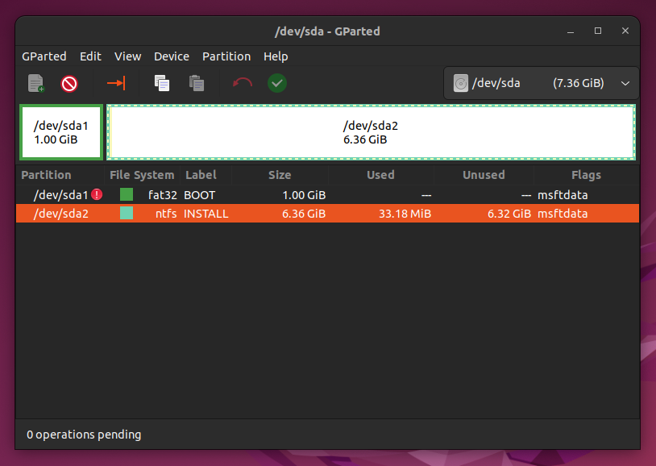
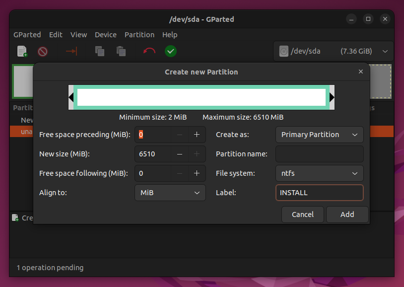
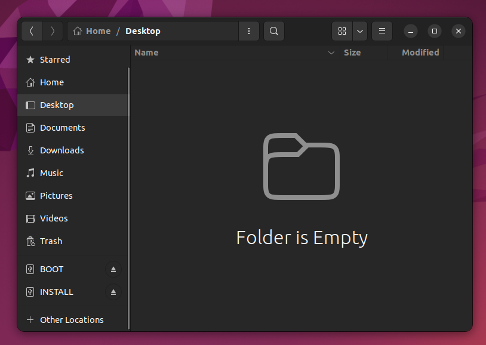

# Windows 11

Download Windows 11 ISO.

https://www.microsoft.com/en-us/software-download/windows11

# Prepare the USB Stick

## Create the Partition Table - GPT

## Create the Partitions

## Install Partition

## Mount

# Copy Files

Mount the ISO file on Ubuntu and copy files to the BOOT and INSTALL folders

# Install

Make sure you have enough unallocated space to install Windows 11.

# Copy the Storage Driver

# Windows 11 is Ready!

# OR Use VirtualBox

